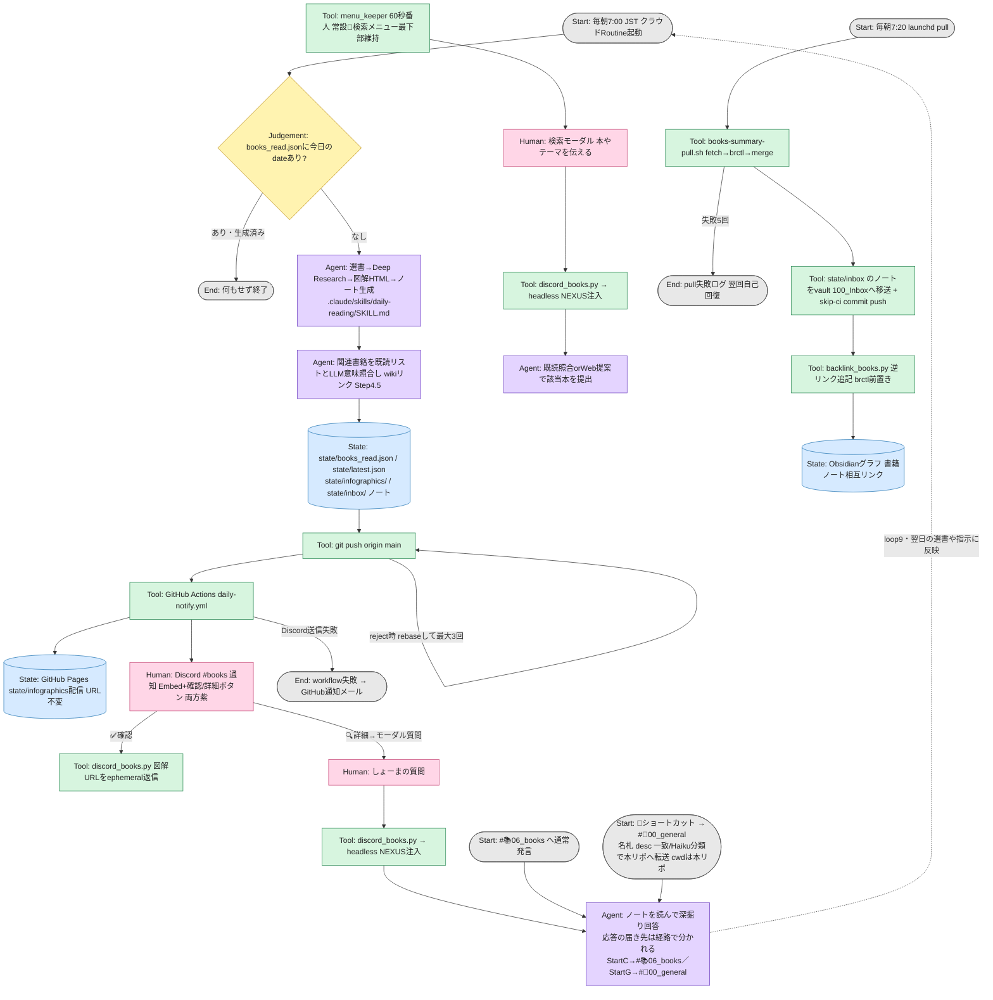

# books-summary

> 目的: 毎朝7:00に「今日読むべき本」をAIが選定・リサーチし、図解付きサマリーをDiscordへ届けて読書習慣と知識インプットを自動化する。
> 完成条件: 成果と評価は最低1つの Reality Anchor（外部事実）に接続する。

**第3弾まで実装済み**（第1弾: ローカルAPI版 → 第2弾: クラウドRoutine+LINE版 → 第3弾: 06_Books移設・Discord通知・LLM関連リンク版）。変更履歴は [docs/更新記録.md](docs/更新記録.md)

## フォルダとライフサイクル10要素（State / Node の置き場）

| 原則 | フォルダ | ライフサイクル要素 | 役割 |
|---|---|---|---|
| 読む | `.claude/` | Node定義 | AIが読む指示書（`.claude/skills/daily-reading/SKILL.md` はクラウドRoutineが読む本体） |
| 行う | `src/` | Node実装 | 機械が実行する処理系 |
| 書く | `state/` | State | 機械が書き残す記憶（生成物は `state/infographics/` 図解HTML・`state/inbox/` ノート一時置き場） |
| 見る | `docs/` | State | 人が読む記録（公開HTMLは `state/infographics/` から Pages Actions 配信） |
| 企む | `plans/` | State（一時） | NEXUSの実行計画。コミットメッセージに全文転記して削除 |

上記5フォルダはライフサイクル10要素のうち State / Node の置き場。Edgeは専用フォルダを持たない。`CLAUDE.md`の規則とスクリプト内の分岐が実体。

Judgementも専用フォルダを持たない。Edge上の条件分岐として実装内に存在する。

Humanノードも専用フォルダを持たない。人間本人と通知チャネル（Discord `#📚06_books`）が実体。

正本（append-only）: `state/books_read.json`（既読リスト。Routineが毎日1件追記、削除しない）

## ライフサイクル10要素

設計正本は [docs/設計記録.md](docs/設計記録.md)。ここでは一覧のみ示す。

| # | 要素 | 一行説明 |
|---|---|---|
| 0 | Purpose | 目的関数と制約。改訂できるのは9. Humanのみ |
| 1 | Start | 開始条件・トリガー・入力の型 |
| 2 | State | 正本・証跡・checkpoint。run跨ぎで残すものがloop9の成立条件 |
| 3 | Node | Agent/Tool/Human/Evaluatorの責務と入出力 |
| 4 | Edge | 遷移条件と接続 |
| 5 | Judgement | 機械が即決する分岐。即決できないなら7か9へ |
| 6 | Loop | node再試行の戻り先・上限・出口 |
| 7 | Verification | 3rd partyによる最終関門（評価者＝作り手と別ベンダー）。固定基準で裁く。自己採点しない |
| 8 | End | 全runが必ず到達する終端（正常・エラー両方） |
| 9 | Human | Endの外。通知を受け、feedbackが次runのStartになる。Validation（妥当性確認）層 |

3層ループは時間スケールが異なる。

- loop6（node再試行）: 秒〜分、同一run内
- loop7（verification差し戻し）: run単位
- loop9（human）: 時間〜日、run跨ぎの非同期

## Node種別

| 種別 | 色 | 表現 |
|---|---|---|
| Agent | 紫 | AIによる処理 |
| Tool | 緑 | スクリプトによる処理 |
| Human | 桃 | 人間による入力・判断・通知受領 |
| Evaluator | 橙 | 六角形のVerification（3rd party）担当者 |
| State | 青 | 円筒形の状態保存先 |

Judgementは Edge上の条件分岐であり Node ではない。

## 依存グラフ

## エラー出口一覧

出口の届き先が空欄の行があってはなりません。

| ノード | 失敗条件 | 最大試行 | 出口の届き先 |
|---|---|---:|---|
| Routine（クラウド） | push reject | 3 | Routine実行履歴（claude.ai/code/routines）＋翌朝Discord通知が来ないことで発覚 |
| daily-notify.yml Discord送信 | HTTP 2xx以外 | 1 | workflow失敗 → GitHubの失敗通知メール |
| books-summary-pull.sh | fetch/merge失敗 | 5 | `~/Library/Logs/BooksSummary/pull.log`（翌回実行で自己回復） |
| ノート移送コミットのpush | reject | 3 | pull.log（次回実行の未pushコミット回収で自己回復） |
| backlink_books.py | ノート不在・退避タイムアウト | 各1 | pull.log（部分失敗でも pull は成功扱い） |
| discord_books.py | 台帳未検出・図解URL不明 | 1 | Discord上でエラー返答（ephemeral） |
| menu_keeper | メニュー貼り直し失敗 | 60秒ごと再試行 | daemon.log（次周期で自己回復） |

## むずかしい言葉なし版

朝7時にクラウドのAIが本を1冊選んで調べ、図解ページと読書ノートを作って保存する。7時すぎにスマホのDiscordへ「今日の一冊」が届き、✅確認を押すと図解が開き、🔍詳細を押すと質問箱が出てAIと深掘りできる。7時20分にMacが自動で最新を取り込み、ノートはObsidianの受信箱に移って、関連する過去の本と線で繋がる。壊れたときはDiscordに通知が来ないことで気づけて、ログは `~/Library/Logs/BooksSummary/` にある。
