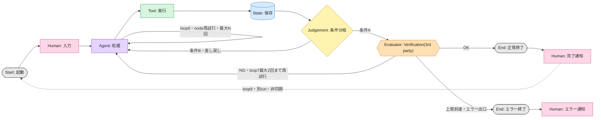

# books-summary

> 目的: （このプロジェクトが実現することを一文で記入）
> 完成条件: 成果と評価は最低1つの Reality Anchor（外部事実）に接続する。

**第N弾まで実装済み**（実装内容を記入）。変更履歴は [docs/更新記録.md](docs/更新記録.md)

## フォルダとライフサイクル10要素（State / Node の置き場）

| 原則 | フォルダ | ライフサイクル要素 | 役割 |
|---|---|---|---|
| 読む | `.claude/` | Node定義 | AIが読む指示書 |
| 行う | `src/` | Node実装 | 機械が実行する処理系 |
| 書く | `state/` | State | 機械が書き残す記憶 |
| 見る | `docs/` | State | 人が読む記録 |

上記4フォルダはライフサイクル10要素のうち State / Node の置き場。Edgeは専用フォルダを持たない。`CLAUDE.md`の規則とスクリプト内の分岐が実体。

Judgementも専用フォルダを持たない。Edge上の条件分岐として実装内に存在する。

Humanノードも専用フォルダを持たない。人間本人と通知チャネルが実体。

正本（append-only）: （上書きせず追記するStateのパスを記入）

## ライフサイクル10要素

設計正本は [docs/設計記録.md](docs/設計記録.md)。ここでは一覧のみ示す。

| # | 要素 | 一行説明 |
|---|---|---|
| 0 | Purpose | 目的関数と制約。改訂できるのは9. Humanのみ |
| 1 | Start | 開始条件・トリガー・入力の型 |
| 2 | State | 正本・証跡・checkpoint。run跨ぎで残すものがloop9の成立条件 |
| 3 | Node | Agent/Tool/Human/Evaluatorの責務と入出力 |
| 4 | Edge | 遷移条件と接続 |
| 5 | Judgement | 機械が即決する分岐。即決できないなら7か9へ |
| 6 | Loop | node再試行の戻り先・上限・出口 |
| 7 | Verification | 3rd partyによる最終関門（既定: FABER）。固定基準で裁く。自己採点しない |
| 8 | End | 全runが必ず到達する終端（正常・エラー両方） |
| 9 | Human | Endの外。通知を受け、feedbackが次runのStartになる。Validation（妥当性確認）層 |

3層ループは時間スケールが異なる。

- loop6（node再試行）: 秒〜分、同一run内
- loop7（verification差し戻し）: run単位
- loop9（human）: 時間〜日、run跨ぎの非同期

## Node種別

| 種別 | 色 | 表現 |
|---|---|---|
| Agent | 紫 | AIによる処理 |
| Tool | 緑 | スクリプトによる処理 |
| Human | 桃 | 人間による入力・判断・通知受領 |
| Evaluator | 橙 | 六角形のVerification（3rd party）担当者 |
| State | 青 | 円筒形の状態保存先 |

Judgementは Edge上の条件分岐であり Node ではない。

## 依存グラフ

## エラー出口一覧

出口の届き先が空欄の行があってはなりません。

| ノード | 失敗条件 | 最大試行 | 出口の届き先 |
|---|---|---:|---|
| （記入） | （記入） | （回数） | （Humanノード・通知チャネル） |

## むずかしい言葉なし版

（専門用語を使わず、何を入力すると何が起き、困ったとき誰に届くかを記入）
